# 🚗 Clean Route Backend Microservice

[](https://golang.org/)
[](https://gin-gonic.com/)
[](LICENSE)
[](https://docker.com/)

> A modern, high-performance microservice for intelligent route planning with real-time air quality and weather data integration.

## ✨ Features

- 🛣️ **Multi-modal Route Planning** - Support for car, scooter, and other transportation modes
- 🌬️ **Real-time Air Quality** - Live AQI data from WAQI API with PM2.5 predictions
- 🌤️ **Weather Intelligence** - Current and forecasted weather conditions
- ⚡ **Energy Optimization** - Route energy calculation based on vehicle type and conditions
- 🎯 **Smart Routing** - Multiple preferences: fastest, shortest, balanced, low-emission, low-exposure
- 🔄 **Backward Compatible** - Maintains existing API endpoints while adding new features
- 🐳 **Container Ready** - Docker support for easy deployment
- 📊 **Health Monitoring** - Built-in health checks and monitoring endpoints
- **PM2.5 Prediction** - Machine learning-based air quality forecasting using custom deployed ML models

## 🚀 Architecture

```mermaid
graph TB
    subgraph "🌐 Client Layer"
        C[Web Client]
        M[Mobile App]
        API[API Client]
    end

    subgraph "🚀 Clean Route Backend"
        subgraph "📡 API Layer"
            H1[Route Handler]
            H2[Weather Handler]
            H3[AQI Handler]
            H4[Prediction Handler]
        end

        subgraph "⚙️ Business Logic"
            S1[Route Service]
            S2[Weather Service]
            S3[AQI Service]
        end

        subgraph "📊 Data Layer"
            M1[Request Models]
            M2[Response Models]
            M3[External Models]
        end

        subgraph "🔧 Infrastructure"
            CFG[Config Manager]
            MW[Middleware]
            UTILS[Utilities]
        end
    end

    subgraph "🌍 External Services"
        MAPBOX[Mapbox API]
        GRAPH[GraphHopper API]
        WAQI[WAQI API]
        OW[OpenWeather API]
        ML[Custom ML Models]
    end

    %% Client connections
    C --> H1
    C --> H2
    C --> H3
    C --> H4
    M --> H1
    M --> H2
    M --> H3
    M --> H4
    API --> H1
    API --> H2
    API --> H3
    API --> H4

    %% Internal connections
    H1 --> S1
    H2 --> S2
    H3 --> S3
    H4 --> S2

    S1 --> M1
    S1 --> M2
    S2 --> M1
    S2 --> M2
    S3 --> M1
    S3 --> M2

    %% External connections
    S1 --> MAPBOX
    S1 --> GRAPH
    S2 --> OW
    S3 --> WAQI
    S2 --> ML

    %% Infrastructure connections
    CFG --> S1
    CFG --> S2
    CFG --> S3
    MW --> H1
    MW --> H2
    MW --> H3
    MW --> H4
    UTILS --> S1
    UTILS --> S2
    UTILS --> S3
```



## 🚀 Quick Start

### Prerequisites

- **Go 1.20+** - [Download here](https://golang.org/dl/)
- **Docker** (optional) - [Download here](https://docker.com/)
- **direnv** (for local development) - [Install here](https://direnv.net/)

### Local Development

1. **Clone and Setup**
   ```bash
   git clone <repository-url>
   cd go-backend
   ```

2. **Environment Configuration**
   ```bash
   cp .envrc.example .envrc
   # Edit .envrc with your API keys
   direnv allow
   ```

3. **Run the Service**
   ```bash
   go run main.go
   ```

4. **Verify it's Working**
   ```bash
   curl http://localhost:8080/health
   ```

### Docker Deployment

```bash
# Build the image
docker build -t clean-route-backend .

# Run the container
docker run -p 8080:8080 --env-file .envrc clean-route-backend
```

## 📡 API Reference

### Base URL
```
http://localhost:8080
```

### Authentication
Currently, the API uses API keys for external service authentication. Configure these in your environment variables.

### Endpoints

#### 🛣️ Route Planning

##### Find Single Route
```http
POST /route
POST /api/v1/route
```

**Request Body:**
```json
{
  "source": [12.9716, 77.5946],
  "destination": [13.0827, 77.5877],
  "delayCode": 0,
  "mode": "driving-traffic",
  "route_preference": "balanced",
  "vehicle_mass": 1500,
  "condition": "average",
  "engine_type": "petrol"
}
```

**Response:**
```json
{
  "success": true,
  "data": {
    "distance": 12500,
    "duration": 1800000,
    "totalExposure": 45.2,
    "totalEnergy": 2.8
  }
}
```

##### Find All Routes
```http
POST /all-routes
POST /api/v1/routes
```

Returns all route types (fastest, shortest, balanced, low-emission, low-exposure) for the given request.

#### 🌤️ Weather Data

```http
GET /api/v1/weather?lat=12.9716&lon=77.5946
```

**Response:**
```json
{
  "success": true,
  "data": {
    "current": {
      "temp": 25.5,
      "humidity": 65,
      "wind_speed": 5.5,
      "wind_direction": 180
    },
    "hourly": [...]
  }
}
```

#### 🌬️ Air Quality

```http
GET /api/v1/aqi?lat=12.9716&lon=77.5946
```

**Response:**
```json
{
  "success": true,
  "data": {
    "aqi": 45.2
  }
}
```

#### 🔮 PM2.5 Prediction

```http
POST /api/v1/predict/pm25
```

**Request Body:**
```json
{
  "features": [
    {
      "ITEMP": 25.5,
      "IRH": 65.2,
      "IWD": 180.0,
      "IWS": 5.5,
      "IPM": 45.0,
      "FTEMP": 26.0,
      "FRH": 63.0,
      "FWD": 175.0,
      "FWS": 6.0,
      "delayCode": 0
    }
  ]
}
```

**Response:**
```json
{
  "success": true,
  "data": {
    "predictions": [42.3, 38.7, 41.2]
  }
}
```

#### 💚 Health Check

```http
GET /health
```

**Response:**
```json
{
  "status": "healthy",
  "service": "clean-route-backend"
}
```

## ⚙️ Configuration

### Environment Variables

| Variable | Description | Required | Default |
|----------|-------------|----------|---------|
| `MAPBOX_API_KEY` | Mapbox API key for route planning | ✅ | - |
| `GRAPHHOPPER_API_KEY` | GraphHopper API key for alternative routes | ✅ | - |
| `WAQI_API_KEY` | WAQI API key for air quality data | ✅ | - |
| `OPEN_WEATHER_API_KEY` | OpenWeather API key for weather data | ✅ | - |
| `ML_MODEL_ENDPOINT` | Custom ML models endpoint for PM2.5 predictions | ✅ | - |
| `RAILWAY` | Set to "true" for Railway deployment | ❌ | false |
| `PORT` | Server port | ❌ | 8080 |

### Example `.envrc` File

```envrc
MAPBOX_API_KEY=your_mapbox_key_here
GRAPHHOPPER_API_KEY=your_graphhopper_key_here
WAQI_API_KEY=your_waqi_key_here
OPEN_WEATHER_API_KEY=your_openweather_key_here
ML_MODEL_ENDPOINT=https://your-ml-models-endpoint.com
PORT=8080
```

## 🔧 Development

### Project Structure

```
go-backend/
├── internal/
│   ├── config/          # Configuration management
│   ├── handlers/        # HTTP request handlers
│   ├── middleware/      # HTTP middleware
│   ├── models/          # Data models and structures
│   ├── services/        # Business logic services
│   └── utils/           # Utility functions
├── main.go              # Application entry point
├── go.mod               # Go module file
├── go.sum               # Go module checksums
├── Dockerfile           # Docker configuration
└── README.md            # This file
```

### Adding New Features

1. **Models** - Add data structures in `internal/models/`
2. **Services** - Implement business logic in `internal/services/`
3. **Handlers** - Create HTTP handlers in `internal/handlers/`
4. **Routes** - Update routes in `main.go`
5. **Tests** - Add tests for new functionality

### Code Style

- Follow Go conventions and best practices
- Use meaningful variable and function names
- Add comments for complex logic
- Handle errors appropriately
- Use consistent formatting (run `go fmt`)

## 🧪 Testing

```bash
# Run all tests
go test ./...

# Run tests with coverage
go test -cover ./...

# Run specific test
go test ./internal/services
```

## 📊 Monitoring & Observability

### Health Checks
- **Endpoint**: `GET /health`
- **Purpose**: Service health monitoring
- **Response**: Service status and metadata

### Logging
- Structured logging for debugging
- Error tracking and reporting
- Performance metrics through HTTP status codes

### Metrics
- Request/response times
- Error rates
- API usage statistics

## 🔒 Security

- **CORS Configuration** - Configured for web client access
- **Input Validation** - Comprehensive validation on all endpoints
- **API Key Management** - Secure environment variable handling
- **Security Headers** - Referrer policy and other security headers
- **Rate Limiting** - Built-in protection against abuse

## 🚀 Deployment

### Railway
```bash
# Deploy to Railway
railway up
```

### Docker Compose
```yaml
version: '3.8'
services:
  clean-route-backend:
    build: .
    ports:
      - "8080:8080"
    env_file:
      - .envrc
```

### Kubernetes
```yaml
apiVersion: apps/v1
kind: Deployment
metadata:
  name: clean-route-backend
spec:
  replicas: 3
  selector:
    matchLabels:
      app: clean-route-backend
  template:
    metadata:
      labels:
        app: clean-route-backend
    spec:
      containers:
      - name: clean-route-backend
        image: clean-route-backend:latest
        ports:
        - containerPort: 8080
        env:
        - name: MAPBOX_API_KEY
          valueFrom:
            secretKeyRef:
              name: api-keys
              key: mapbox-key
```

## 🤝 Contributing

1. Fork the repository
2. Create a feature branch (`git checkout -b feature/amazing-feature`)
3. Commit your changes (`git commit -m 'Add amazing feature'`)
4. Push to the branch (`git push origin feature/amazing-feature`)
5. Open a Pull Request

## 📄 License

This project is licensed under the MIT License - see the [LICENSE](LICENSE) file for details.

## 🙏 Acknowledgments

- **Mapbox** - Route planning and directions
- **GraphHopper** - Alternative routing and energy calculations
- **WAQI** - Air quality data
- **OpenWeather** - Weather data and forecasts
- **Custom ML Models** - Machine learning predictions

## 📞 Support

- **Issues**: [GitHub Issues](https://github.com/clean-route/go-backend/issues)
- **Documentation**: [API Docs](https://your-docs-url.com)

---

<div align="center">
  <p>Built with ❤️ for a cleaner, smarter future</p>
  <p>
    <a href="https://github.com/clean-route/go-backend/stargazers">
      
    </a>
    <a href="https://github.com/clean-route/go-backend/network">
      
    </a>
    <a href="https://github.com/clean-route/go-backend/issues">
      
    </a>
  </p>
</div>

## External API Integrations

- **Mapbox Directions API** - Primary route planning for cars
- **GraphHopper API** - Alternative routes and energy calculations
- **WAQI API** - Air quality data
- **OpenWeather API** - Weather data
- **Custom ML Models** - PM2.5 prediction model